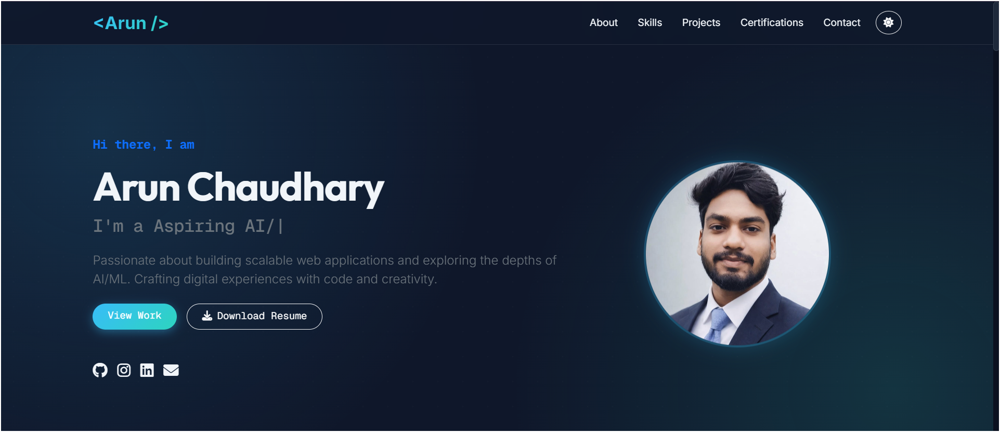

# 🚀 Personal Portfolio - Arun Chaudhary

**Standard of Excellence | Full-Stack Web Developer | AI/ML Enthusiast**

[](https://arunportfolio-two.vercel.app/)



## 📖 Overview
Welcome to my personal portfolio repository! This responsive, high-performance website showcases my journey as a **Computer Science Engineer**, highlighting my expertise in **Full-Stack Development**, **Artificial Intelligence**, and **Machine Learning**.

Designed with a **premium, dark-themed aesthetic**, this portfolio features glassmorphism effects, smooth animations, and a user-friendly layout to provide an immersive experience for recruiters and visitors.

---

## ✨ Key Features
- **🎨 Premium UI/UX**: Dark mode with "Mesh Gradient" backgrounds and Glassmorphism styling.
- **📱 Fully Responsive**: Optimized for all devices (Mobile, Tablet, Desktop) using Bootstrap 5.
- **✨ Interactive Elements**:
  - **Typing Effect** in the Hero section.
  - **Scroll Animations** powered by AOS (Animate On Scroll).
  - **Hover Effects** on skill chips and project cards.
- **📂 Structured Code**: Clean seperation of concerns (HTML, CSS, JS).
- **🛠️ Dynamic Content**: automated year updates in the footer.

---

## 🛠️ Tech Stack
- **Frontend**: HTML5, CSS3, JavaScript (ES6+)
- **Styling**: Bootstrap 5, Custom CSS Variables, Glassmorphism
- **Animations**: AOS.js, Typed.js, FontAwesome Icons
- **Version Control**: Git & GitHub

---

## 📂 Project Structure
```bash
Portfolio/
├── index.html       # Main HTML structure
├── style.css        # Premium custom styles & glassmorphism
├── script.js        # Logic for animations & interactivity
├── .gitignore       # Git exclusion rules
├── README.md        # Project documentation
└── assets/          # Images and static assets
```

---

## 🚀 Getting Started

### Prerequisites
You only need a modern web browser (Chrome, Firefox, Edge, etc.) to view this project.

### Installation
1. **Clone the repository**:
   ```bash
   git clone https://github.com/arunchary45/Portfolio.git
   ```
2. **Navigate to the project directory**:
   ```bash
   cd Portfolio
   ```
3. **Open `index.html`**:
   - Double-click `index.html` to open it in your browser.
   - OR use an extension like **Live Server** in VS Code for a better experience.

---

## 📬 Get In Touch
I'm always open to new opportunities and collaborations!

- **Email**: [arunchaudhary9054@gmail.com](mailto:arunchaudhary9054@gmail.com)
- **LinkedIn**: [Arun Chaudhary](https://www.linkedin.com/in/arunchary45/)
- **GitHub**: [arunchary45](https://github.com/arunchary45)

---

## 📜 License
© 2026 **Arun Chaudhary**. All rights reserved.
Design inspired by modern web aesthetics.
